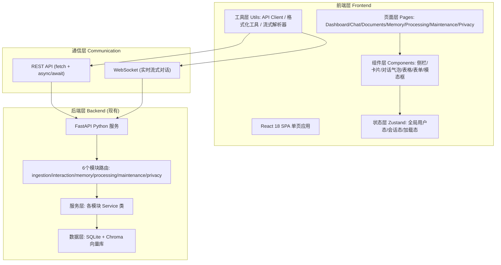
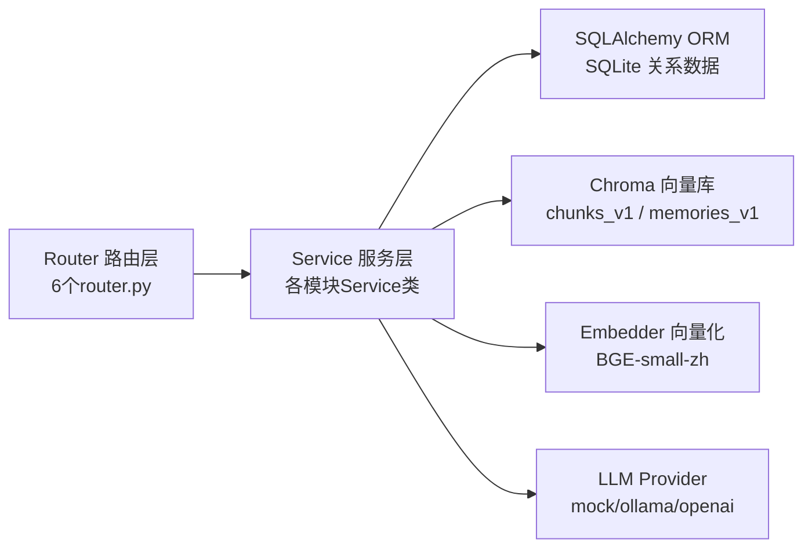
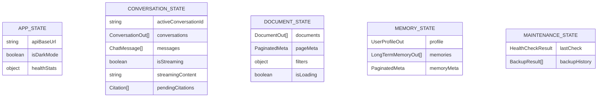

## 1. 架构设计



## 2. 技术说明

- **前端框架**：React 18 + TypeScript 5
- **构建工具**：Vite 5
- **样式方案**：Tailwind CSS 3（原子类 + CSS 变量主题系统）
- **状态管理**：Zustand 4（轻量 store，拆分会话/文档/系统等 slice）
- **路由**：React Router DOM 6（嵌套路由 + 侧栏布局）
- **图标库**：lucide-react
- **HTTP客户端**：原生 fetch 封装 + 统一拦截器（处理 ApiResponse 结构、错误提示）
- **WebSocket**：原生 WebSocket API，封装事件流解析器（处理 chat.phase / chat.token / citations 等事件类型）
- **Markdown 渲染**：react-markdown + remark-gfm + rehype-highlight（支持表格/任务列表/代码高亮）
- **初始化方式**：使用 `vite-init` `react-ts` 模板创建纯前端项目（后端已存在，无需 Express）
- **后端通信地址**：默认 `http://127.0.0.1:8000/api/v1`，通过环境变量 `VITE_API_BASE_URL` 可配置

## 3. 路由定义

| 路由路径 | 页面 | 用途 |
|---------|------|------|
| `/` | Dashboard 仪表盘 | 系统概览、统计、快捷操作入口 |
| `/chat` | Chat 智能对话 | 会话列表+对话主区，默认进入空白新会话 |
| `/chat/:conversationId` | Chat 智能对话 | 加载指定历史会话继续对话 |
| `/documents` | Documents 文档管理 | 文档列表、上传、URL导入、搜索筛选 |
| `/documents/:docId` | DocumentDetail 文档详情 | 单文档元数据编辑、重索引、删除 |
| `/memory` | Memory 记忆中心 | 用户画像 + 长期记忆 CRUD |
| `/processing` | Processing 知识处理 | 单文档/全量重索引操作面板 |
| `/maintenance` | Maintenance 系统维护 | 健康检查、备份创建与恢复 |
| `/privacy` | Privacy 隐私安全 | 数据导出下载、擦除、文本脱敏 |
| `*` | NotFound 404 | 重定向回仪表盘 |

## 4. API 定义（TypeScript 类型）

```typescript
// ========== 通用响应 ==========
export interface ApiResponse<T> {
  code: string;       // "SUCCESS" 或错误码
  message: string;
  data: T;
}

export interface PaginatedResponse<T> {
  items: T[];
  total: number;
  page: number;
  page_size: number;
  total_pages: number;
}

export interface HealthResponse {
  status: "ok";
  version: string;
  stats: Record<string, any>;
}

// ========== 文档 Documents ==========
export interface DocumentOut {
  id: string;
  title: string;
  file_type: string;
  source: "upload" | "url";
  source_url?: string;
  file_size?: number;
  status: "pending" | "processing" | "indexed" | "error";
  tags: string[];
  description?: string;
  chunk_count?: number;
  created_at: string;
  updated_at: string;
}
export interface DocumentUploadResponse {
  id: string;
  status: string;
  message?: string;
}
export interface DocumentUpdate {
  title?: string;
  description?: string;
  tags?: string[];
}
export interface DocumentImportUrlRequest {
  url: string;
  title?: string;
  tags?: string[];
}

// ========== 对话 Conversation ==========
export interface ConversationOut {
  id: string;
  title: string;
  message_count: number;
  created_at: string;
  updated_at: string;
}
export interface ConversationCreate {
  title?: string;
}
export interface ChatMessage {
  id: string;
  role: "user" | "assistant" | "system";
  content: string;
  created_at: string;
  citations?: Citation[];
}
export interface Citation {
  type: "document" | "memory";
  source_id: string;
  source_title?: string;
  content: string;
  score?: number;
}
export interface ChatRequest {
  conversation_id?: string;
  query: string;
  stream?: boolean;
  use_memory?: boolean;
}
export interface ChatResponse {
  conversation_id: string;
  message_id: string;
  answer: string;
  citations: Citation[];
  follow_up_questions?: string[];
}
export interface SearchHit {
  id: string;
  type: "document" | "memory";
  title: string;
  content: string;
  score: number;
  source_id?: string;
}
export interface SimpleSearchRequest {
  query: string;
  top_k?: number;
  hybrid?: boolean;
}

// ========== 记忆 Memory ==========
export interface UserProfileOut {
  id: number;
  name?: string;
  occupation?: string;
  interests?: string[];
  learning_style?: string;
  background?: string;
  preferences?: Record<string, any>;
  updated_at: string;
}
export interface UserProfileUpdate {
  name?: string;
  occupation?: string;
  interests?: string[];
  learning_style?: string;
  background?: string;
  preferences?: Record<string, any>;
}
export interface LongTermMemoryOut {
  id: number;
  content: string;
  tags: string[];
  importance: number;
  status: "active" | "archived";
  created_at: string;
  updated_at: string;
}
export interface LongTermMemoryCreate {
  content: string;
  tags?: string[];
  importance?: number;
}

// ========== 维护 Maintenance ==========
export interface HealthCheckResult {
  sqlite: { status: "ok" | "error"; message?: string };
  chroma: { status: "ok" | "error"; message?: string };
  llm: { status: "ok" | "error" | "skip"; message?: string };
  vector_consistency: { status: "ok" | "warning" | "error"; details?: any };
  overall: string;
}
export interface BackupResult {
  backup_path: string;
  size_bytes: number;
  created_at: string;
  files: string[];
}

// ========== 隐私 Privacy ==========
export interface ExportResult {
  export_path: string;
  size_bytes: number;
  files: string[];
  created_at: string;
}
export interface WipeResult {
  wiped_tables: string[];
  wiped_collections: string[];
  completed_at: string;
}
```

## 5. 服务端架构图（现有Python后端，引用展示）



## 6. 数据模型（前端状态模型）

### 6.1 Zustand Store 切片



### 6.2 说明
- 前端不直接操作数据库，所有数据通过 REST/WebSocket 从 FastAPI 获取
- 分页组件统一使用 `PaginatedResponse<T>` 结构，各页面共享
- WebSocket 事件类型：`chat.phase`（阶段变化）、`search.results`（检索结果）、`chat.token`（增量Token）、`citations`（引用）、`follow_ups`（追问）、`chat.done`（完成）、`error`（错误）
