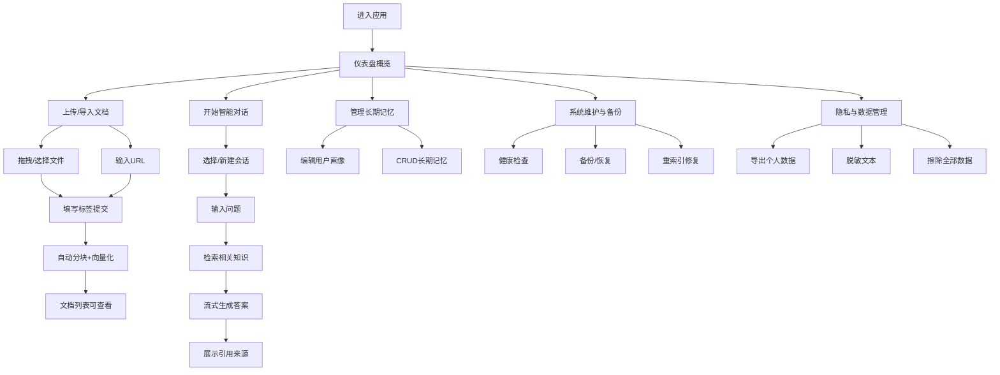

## 1. 产品概述

Self Knowledge Agent 可视化管理界面，为个人知识知识库 Agent 提供图形化操作平台。用户无需手动调用 API，通过直观的 Web 界面即可完成知识摄入、智能问答、记忆管理、系统维护等所有操作。

- 目标用户：个人知识管理者、学习者、研究人员
- 核心价值：将 30 个后端 API 封装为易用的可视化操作，降低使用门槛，提升知识管理效率

## 2. 核心功能

### 2.1 用户角色

| 角色 | 注册方式 | 核心权限 |
|------|---------|---------|
| 个人用户 | 本地直接使用 | 所有功能：文档管理、对话、记忆、维护、隐私 |

### 2.2 功能模块

1. **仪表盘首页**：系统概览、统计卡片、快捷操作入口
2. **智能对话**：会话列表、流式问答、引用来源展示、检索结果预览
3. **文档管理**：文件上传、URL 导入、文档列表、搜索筛选、编辑删除
4. **记忆中心**：用户画像编辑、长期记忆 CRUD
5. **知识处理**：单文档重索引、全量重建索引
6. **系统维护**：深度健康检查、数据备份、备份恢复
7. **隐私安全**：数据导出、文件下载、全量擦除、文本脱敏

### 2.3 页面详情

| 页面名称 | 模块名称 | 功能描述 |
|---------|---------|---------|
| 仪表盘 | 统计概览 | 展示文档数、记忆数、会话数、向量库状态等关键指标 |
| 仪表盘 | 快捷操作 | 一键上传文档、开始新对话、执行健康检查、导出数据 |
| 智能对话 | 会话侧边栏 | 历史会话列表、新建会话、删除会话、搜索会话 |
| 智能对话 | 对话主区 | 消息气泡、流式打字效果、Markdown 渲染、代码高亮 |
| 智能对话 | 引用面板 | 展示检索到的文档片段、长期记忆、相似度分数 |
| 文档管理 | 上传区域 | 拖拽上传、文件选择器、标签输入、支持扩展名提示 |
| 文档管理 | URL 导入 | 网址输入框、标题自定义、标签管理 |
| 文档管理 | 文档列表 | 表格/卡片双视图、关键词搜索、类型/状态筛选、分页 |
| 文档管理 | 文档详情 | 元数据编辑（标题、描述、标签）、重新索引、删除确认 |
| 记忆中心 | 用户画像 | 表单编辑偏好、背景、学习风格、兴趣领域等配置 |
| 记忆中心 | 长期记忆 | 创建卡片、列表展示、状态筛选、编辑删除 |
| 知识处理 | 重索引工具 | 单文档选择操作、全量增量/全量重建、进度展示 |
| 系统维护 | 健康检查 | 各项检查结果（SQLite/Chroma/LLM/向量一致性）、状态图标 |
| 系统维护 | 备份管理 | 创建备份、备份列表、恢复操作、覆盖确认 |
| 隐私安全 | 数据导出 | 导出配置、导出进度、历史导出记录 |
| 隐私安全 | 擦除工具 | 二次确认弹窗、擦除进度、完成提示 |
| 隐私安全 | 文本脱敏 | 文本输入/粘贴、实时脱敏预览、结果复制 |

## 3. 核心流程

### 主要用户流程描述

1. **知识库搭建流程**：用户进入首页 → 点击上传文档或导入URL → 填写标签等元数据 → 提交上传 → 系统自动分块+向量化 → 文档列表显示处理状态 → 完成后可对话
2. **智能问答流程**：用户进入对话页 → 新建或选择历史会话 → 输入问题 → 系统流式返回回复（含检索阶段、搜索结果、逐字生成）→ 点击引用查看来源 → 继续多轮对话
3. **数据维护流程**：用户从侧边栏进入维护页 → 执行健康检查 → 发现异常（如向量不一致）→ 创建备份 → 执行全量重索引 → 再次检查确认正常
4. **隐私操作流程**：用户进入隐私页 → 点击导出全部数据 → 等待生成ZIP → 下载保存 → 如需清空 → 二次确认 → 执行擦除

## 4. 用户界面设计

### 4.1 设计风格

- **主色调**：深青色 `#0891b2`（calm knowledge）搭配暖琥珀 `#d97706`（creative memory）作为强调色
- **中性色**：以 `slate` 系列灰为基础，浅色模式下使用 `#f8fafc` 背景，卡片为纯白
- **按钮风格**：圆角 10px，实心按钮带微渐变 hover，次要按钮为描边样式
- **字体**：标题使用 "Noto Serif SC"（知识感），正文使用 "Noto Sans SC"（易读性）
- **布局**：左侧固定导航栏（260px）+ 顶部面包屑条 + 右侧主内容区，卡片式承载各功能块
- **图标风格**：线性风格（lucide-react），在侧边栏使用，卡片标题辅以小型 emoji 增加温度
- **氛围细节**：主内容卡片添加 1px 浅色边框 + 极淡阴影，对话气泡区分用户/AI 背景色，搜索框添加微动效聚焦边框

### 4.2 页面设计概览

| 页面名称 | 模块名称 | UI 元素 |
|---------|---------|---------|
| 仪表盘 | 统计概览 | 4张渐变统计卡片（文档/记忆/会话/健康），数值+图标，hover上浮效果 |
| 仪表盘 | 快捷操作 | 2x2 快捷按钮卡片，图标+标题+副标题，点击渐变色动效 |
| 仪表盘 | 最近活动 | 时间线展示最近上传/对话/备份记录 |
| 智能对话 | 会话侧边栏 | 可折叠侧栏，顶部新建按钮，列表项含摘要+时间，选中高亮，悬停显示删除 |
| 智能对话 | 对话主区 | 气泡式消息，用户消息靠右青色背景，AI靠左浅色，Markdown+代码块高亮，流式打字光标 |
| 智能对话 | 引用面板 | 消息下方折叠卡片，标签页区分"文档片段/长期记忆"，每项显示来源文档+相似度进度条 |
| 智能对话 | 输入区 | 底部固定输入框，多行文本+发送按钮，支持快捷键 Ctrl+Enter |
| 文档管理 | 上传/导入 | Tab 切换上传/URL，上传区虚线边框拖放，URL表单整洁排列 |
| 文档管理 | 列表工具栏 | 搜索框+类型筛选下拉+状态筛选下拉+视图切换图标 |
| 文档管理 | 文档列表 | 表格视图（缩略图/标题/类型/标签/状态/操作），斑马纹，悬停操作按钮浮现 |
| 记忆中心 | 用户画像 | 分组表单卡片，分组标题图标，文本框+下拉选择+标签输入，底部保存按钮 |
| 记忆中心 | 长期记忆 | 卡片网格，每卡含记忆内容+标签+创建时间，右上角状态徽章，编辑/删除按钮 |
| 知识处理 | 重索引 | 单文档搜索选择器 + 执行按钮，全量操作复选框（增量/全量），进度条实时显示 |
| 系统维护 | 健康检查 | 顶部大检查按钮，下方分区卡片展示各组件状态，绿色✅红色❌图标，详情展开 |
| 系统维护 | 备份列表 | 表格展示历史备份（时间/大小/操作），恢复按钮带确认弹窗 |
| 隐私安全 | 导出/擦除 | 两个危险操作卡片区隔明显，擦除按钮红色+双重确认步骤条 |
| 隐私安全 | 脱敏工具 | 左右分栏：左输入原文，右实时显示脱敏结果，类型图例标注被掩码的内容类型 |

### 4.3 响应式

- **设计优先**：桌面端优先（≥1280px），保证数据管理效率
- **平板适配**（768–1279px）：侧栏切换为抽屉式，统计卡变为2列
- **手机适配**（<768px）：底部 Tab 导航替代侧栏，卡片单列堆叠，对话输入框适配键盘弹起
- **触控优化**：所有可点击元素尺寸≥44px，重要操作增加确认避免误触

### 4.4 3D 场景引导

本项目不涉及 3D 场景，使用 2D 平面+微动效作为交互主基调。
